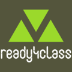

# ready4class 

## Readyforwhatsnext Tools For Creating And Extending Classes.

<!-- badges: start -->
[](https://travis-ci.com/readyforwhatsnext/ready4class)
[](https://www.tidyverse.org/lifecycle/#experimental)
<!-- badges: end -->

ready4class provides classes and methods that
are designed to standardise and streamline the process for extending
the readyforwhatsnext data synthesis and simulation framework with new
classes.  This development version of the ready4class package has been
made available as part of the process of testing and documenting the
package. That means this should be regarded as UNTESTED software,
which is provided for free WITHOUT ANY WARRANTY. Importantly, the
tools contained in this test release automate a number of tasks which
MODIFY THE DIRECTORY STRUCTURE OF YOUR LOCAL MACHINE.  While we
welcome and appreciate anyone who takes the time to provide us with
feedback on this test release, we caution you that you should only
test this software if you feel confident you understand what it does
and have created a sandpit area in which you can safely undertake
testing. If you have any questions, please contact the authors
(matthew.hamilton@orygen.org.au).

If you plan on testing this software you can install it by running the following commands in your R console:

```r
install.packages("devtools")

devtools::install_github("readyforwhatsnext/ready4class")

```
